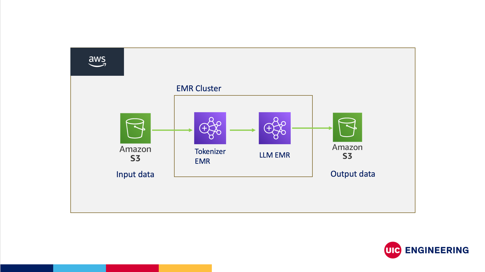

# Hadoop-LLM-AWS-EMR: Large-Scale Text Processing and Embeddings

**Author**: Sunil Kuruba <br />
**UIN**: 659375633 <br />
**Email**: skuru@uic.edu <br />
**Instructor**: Mark Grechanik

[Youtube video](https://youtu.be/TylcxCHhEik)

## Project Summary

This project focuses on implementing a distributed solution for processing large-scale text data using Hadoop on AWS EMR. The system leverages custom MapReduce jobs to tokenize large corpora and generate vector embeddings using a custom Token Generator. The goal is to enable efficient parallel processing for tasks like natural language understanding, large language model (LLM) training, and text analysis by harnessing the scalable resources of AWS Elastic MapReduce (EMR).

The solution is built using Scala for the MapReduce logic, with two main classes handling different stages of the text processing pipeline. This project also aims to demonstrate the deployment of MapReduce jobs in AWS EMR clusters with multiple steps, using a single JAR file for the entire workflow.


## Project Structure

```bash
├── src
│   ├── main
│   │   ├── scala
│   │   │   ├── Tokenizer.scala       # Tokenization logic for MapReduce
│   │   │   ├── Embedding.scala       # Generating embeddings MapReduce
│   │   │   ├── JobConfig.scala       # Setting Job configuration
│   │   │   ├── Utility.scala         # Utility class for text parsing
│   │   ├── resources
│   │       ├── application.conf      # Configuration file for Hadoop and job settings
├── README.md                         # Project documentation
├── build.sbt                         # Build configuration file
└── project
    ├── dependencies.sbt              # Project dependencies
```
## Prerequisites

To run this project, you will need the following:

1. **Scala 3.5**: Ensure Scala is installed on your machine.
2. **Java JDK 8**: Scala uses Java platform to perform runs
3. **Sbt 1.10.2**: For building scala project
2. **Hadoop 3.3.3**: A working Hadoop setup (either local or AWS EMR).
3. **AWS Account**: Access to an AWS account to create and manage an EMR cluster.
4. **EMR Cluster**: Set up an EMR cluster on AWS with sufficient nodes for distributed processing.
5. **S3 Bucket**: Create an S3 bucket to store input data and retrieve output.
6. **Git**: Version control for managing and deploying the project.

## Steps to Execute the Project
1. Clone the Repository
    ```bash
   git clone https://github.com/SunilKuruba/CS441-HW1.git
   cd hadoop-llm-aws-emr
   
2. Prepare AWS
* Create S3 bucket to store the JARs and input data. Make a note of the S3 paths.
* Load the input training files of your choice in the S3 folder
```bash
├── jar
│   └── common.jar                    # Common jar file
├── input
│   ├── novel.txt                     # Input text file
│   ├── subtitles.csv                 # Input CSV file
├── output                            # Output folder (initially empty)
```

3. Select Environment </br>
   Update the `JobConfig.environment` variable according to your use case, then follow these environment-specific steps: 

|  Environment | Configuration Requirements                                                                                                                        |
|---|---------------------------------------------------------------------------------------------------------------------------------------------------|
| Production | Update application configuration file: </br> - io.inputdir.prod (S3 input path) </br> - io.outputdir.prod (S3 output path)                        |
|  Local Development | Ensure Hadoop processes are running on your laptop. Ensure that the hadoop fs has the required input and output path as per `application.config`. |
| Test  | Ensure Hadoop processes are running on your laptop. No configuration updates required. Checkout test/resources for input and output.              |

4. Build the Project </br>
    Use sbt to compile the project and produce the necessary JAR file. You should be able to find your JAR in the relative path `target/scala-3.5.0/..`
   ```bash
    sbt clean compile assembly
5. Upload JAR to S3
   Upload your generated JAR file and text corpus to S3:

    ```bash
    aws s3 cp <target/scala-3.5.0/common.jar> s3://your-bucket-name/
    aws s3 cp input-data.txt s3://your-bucket-name/  # Optional step
6. Create an AWS EMR Cluster
   Launch an EMR cluster with the following configurations:
   * Instance type: Select an instance type based on your specific processing requirements (e.g., m5.xlarge).
   * Application: Install Hadoop only.
   * Add steps:
     * Tokenizer step:
       * Jar location: [input S3 common JAR path]
       * Jar arguments: tokenizerMain
     * Embedding step:
       * Jar location: [input S3 common JAR path]
       * Jar arguments: embeddingMain
   * Submit the job to EMR for processing.

7. Check Results
   Monitor the job for completion. Once the steps complete, retrieve the results from S3 output path and inspect the generated embeddings:

   ```bash
    aws s3 cp s3://your-bucket-name/output/ ./output --recursive
   ```
   


